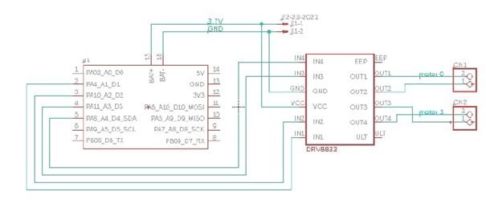

# NanoTank Seeed Studio XIAO ESP32S3

## Description
Inspiration: https://www.instructables.com/Camera-NanoTank/

I decided to build nanotank, using recommended electronics and provided 3D design. I developed custom software that enables to control two DC motors and capture live stream from attached camera via web app.

System is based on client-server architecture. The web server is hosted on the XIAO ESP32S3 and the website is uploaded to it's memory with the help of SPIFFS. Image frames, one after another, are being sent via async http server (MJPEG). As soon as client enters the page, there is opened WebSocket connection, which allows to steer the vehicle.

https://github.com/user-attachments/assets/15a5b86b-67b6-4ed3-abb2-540a1dd06c21

## Pinout Connections

- XIAO ESP32S3 Pins:
  - GPIO2, GPIO3, GPIO4, GPIO5 to DRV8833: IN4, IN3, IN2, IN1
- DRV8833 Pins:
  - OUT1, OUT2, OUT3, OUT4 to MOTOR1 (-, +) and MOTOR2 (+, -)
- Power Connections:
  - External 3.7V battery + and - connected to both:
    - ESP32S3: BAT+ and BAT-
    - DRV8833: VCC and GND
- Camera module OV2640 connector:
	 - B2B connector on the XIAO ESP32S3
- Antenna Wi-Fi:
	- WiFi/BT Antenna Connector on the XIAO ESP32S3  
## Configuration
1. Download Arduino IDE (version 1.x.x in order to let ESP32 Filesystem Uploader plugin work). In version 2.x.x plugin is not supported.
2. Install ESP32 filesystem uploader, follow the instructions from: https://github.com/me-no-dev/arduino-esp32fs-plugin.
3. In Arduino IDE go to: File > Preferences and place URL: https://raw.githubusercontent.com/espressif/arduino-esp32/gh-pages/package_esp32_index.json in the field Additional Boards Manager URLs.
4. Choose your board. Go to Tools > Board > Boards Manager. Search for "esp32" and install the latest version of package. For Xiao ESP32-S3 board it must be at least 2.0.8.
5. Download necessary libraries (.zip files). AsyncTCP (https://github.com/me-no-dev/AsyncTCP), ESPAsyncWebServer (https://github.com/me-no-dev/ESPAsyncWebServer), ESP32MotorControl (https://github.com/JoaoLopesF/ESP32MotorControl).
6. Import libraries into your Arduino sketch, go to  Sketch > Include Library > Add .ZIP Library... and add those 3 libraries.
## Manual
1. Download code from this repository.
2. At the begining of file tank.ino change the name (ssid) and password to Wi-Fi you are connected. For example, you can run this on your mobile hotspot, in the code - type name and password.
3. In Arduino IDE choose correct port and board and upload the code to XIAO ESP32S3.
4. After succesfull upload, open serial monitor, where you should get IP address of website with interface.
5. Open index.html, which is in "data" folder and at the begining change var ip_address to ip given in serial monitor. Save the changes.
6. By clicking Tools > ESP32 Sketch Data Upload, upload your data folder (index.html and style.css) (choose SPIFFS).
7. Make sure your device (phone/pc) is connected to Wi-Fi, which ssid and password is provided in code.
8. Open a browser and navigate to provided address to access the website, where the controlling interface should appear.

## Sources and inspirations
#### ESP32MotorControl library
https://github.com/JoaoLopesF/ESP32MotorControl
#### WebSocket Server
Web socket server based on this article:\
https://shawnhymel.com/1882/how-to-create-a-web-server-with-websockets-using-an-esp32-in-arduino/ 
#### Camera stream on  AsyncWebServer
Streaming live footage based on:\
https://gist.github.com/me-no-dev/d34fba51a8f059ac559bf62002e61aa3 

